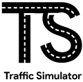

# Projet : Simulation du trafic routier



Projet de fin de classe préparatoire au Cycle Préparatoire de Bordeaux
dans l'objectif d'intégrer l'ENSEIRB-MATMECA.
Par Fabien SAVY & Killian TROLES.

## Résumé
Ces dernières décennies, le trafic routier ne cesse de croître en même temps que l’attractivité des villes. Les automobilistes sont donc de plus en plus confrontés aux embouteillages, qui ont de nombreuses conséquences. Pour trouver des solutions à ce problème, il est nécessaire de comprendre l’origine des congestions. C’est dans ce but que nous avons créé un programme permettant de simuler le trafic routier. Il s’appuie sur l’Intelligent Driver Model, modèle de voitures suiveuses et sur les concepts de la Programmation Orientée Objet. Nous avons créé des objets Véhicules, Routes et Intersections, ainsi que des attributs et méthodes pour chacun, afin de pouvoir simuler le trafic sur un réseau routier. De plus, peu de documentation étant accessible sur la gestion des intersections, un nouveau modèle de gestion a été créé et implémenté dans l’application. Enfin, pour constater concrètement les résultats de la simulation, une interface graphique a été conçue. Elle permet d’avoir une vue d’ensemble ou de se concentrer sur des zones particulières. L’affichage a été pensé pour montrer le maximum d’informations et permettre à l’utilisateur d’interagir avec la simulation.

## Utilisation
Utilisez le créateur de carte pour créer votre propre réseau
```
python3 map_creator
```

Exécutez le moteur de la simulation pour la voir en action
```
python3 main.py
```
